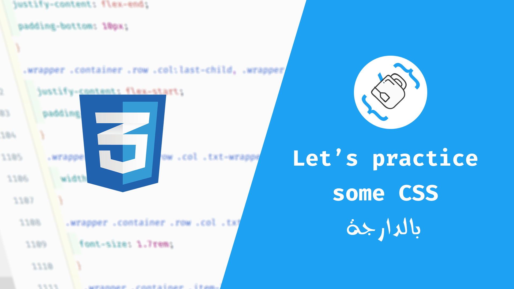

# Css Battle Challenges

A few suggested solutions for some cssbattle challenges

Visit [cssbattle](https://cssbattle.dev/) website for more challenges

* Acid-Rain - [Challenge Link](https://cssbattle.dev/play/5) / [Solution Link](https://github.com/teacodema/Practice-css-darija/tree/master/5-Acid-Rain)
* Equals - [Challenge Link](https://cssbattle.dev/play/31) / [Solution Link](https://github.com/teacodema/Practice-css-darija/tree/master/31-Equals)
* Bell - [Challenge Link](https://cssbattle.dev/play/68) / [Solution Link](https://github.com/teacodema/Practice-css-darija/tree/master/68-Bell)
* Wig - [Challenge Link](https://cssbattle.dev/play/134) / [Solution Link](https://github.com/teacodema/Practice-css-darija/tree/master/134-Wig)
* Birdie - [Challenge Link](https://cssbattle.dev/play/33) / [Solution Link](https://github.com/teacodema/Practice-css-darija/tree/master/33-Birdie)
* Door Knob - [Challenge Link](https://cssbattle.dev/play/64) / [Solution Link](https://github.com/teacodema/Practice-css-darija/tree/master/64-Door-Knob)
* Pokeball - [Challenge Link](https://cssbattle.dev/play/95) / [Solution Link](https://github.com/teacodema/Practice-css-darija/tree/master/95-Pokeball)
* Command-Key - [Challenge Link](https://cssbattle.dev/play/63) / [Solution Link](https://github.com/teacodema/Practice-css-darija/tree/master/63-Command-Key)
* Ice Cream - [Challenge Link](https://cssbattle.dev/play/35) / [Solution Link](https://github.com/teacodema/Practice-css-darija/tree/master/35-Ice-Cream)
* Eye of the Tiger - [Challenge Link](https://cssbattle.dev/play/16) / [Solution Link](https://github.com/teacodema/Practice-css-darija/tree/master/16-Eye-of-the-Tiger)
* Mandala - [Challenge Link](https://cssbattle.dev/play/96) / [Solution Link](https://github.com/teacodema/Practice-css-darija/tree/master/96-Mandala)
